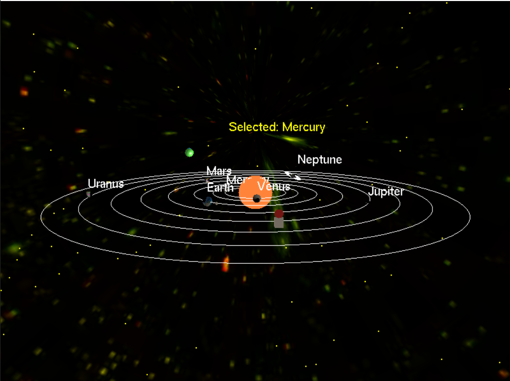
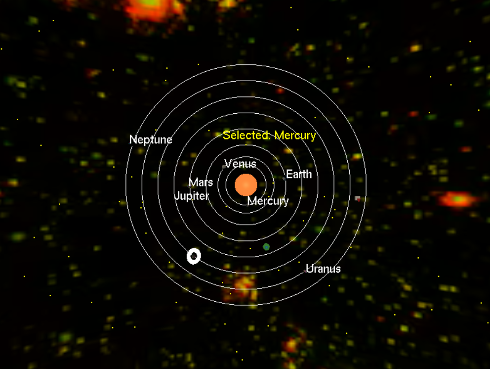
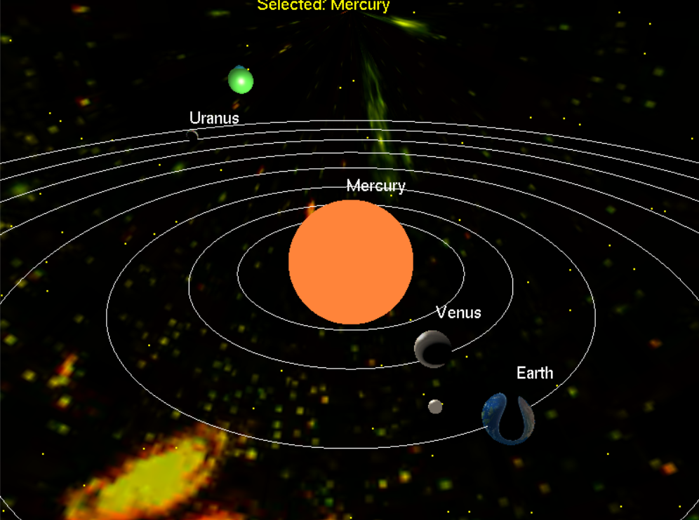
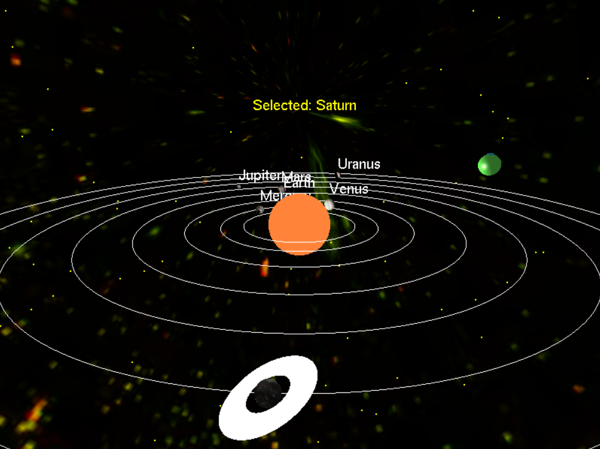

# 3D Solar System Simulation

A real-time 3D solar system simulation built with OpenGL and C++. This project features realistic planetary orbits, textures, lighting, and interactive camera controls.

## Features

- **Realistic Planetary Motion**: Each planet orbits the Sun with accurate relative speeds
- **High-Quality Textures**: Detailed planet textures for all 8 planets and the Sun
- **Interactive Camera**: Orbit around the solar system with keyboard controls
- **Focus Mode**: Zoom in on individual planets
- **Top View Mode**: Switch to top-down view of the solar system
- **Dynamic Lighting**: Realistic lighting with the Sun as the light source
- **Sun Pulsing Effect**: Animated sun with glowing effect
- **Saturn's Rings**: Special rendering for Saturn's distinctive rings
- **Additional Objects**: Rocket and UFO animations
- **Starfield Background**: Thousands of stars in the background
- **Pause/Resume**: Spacebar to pause/resume planetary motion
- **Planet Size Control**: Adjust individual planet sizes in real-time

## Screenshots

> **Note**: This is our project screenshots is it realtime simulation

### Main View

*Default view of the solar system with all planets orbiting the Sun*

### Top View

*Top-down view showing planetary orbits (Press T)*

### Focus Mode

*Focused view on a specific planet (Press F to toggle, N/B to cycle)*

### Sun Pulsing Effect

*Animated sun with glowing pulsing effect*

### Saturn with Rings

*Detailed rendering of Saturn with its distinctive rings*

## Controls

- **W/S**: Zoom in/out
- **A/D**: Rotate camera left/right
- **Space**: Pause/resume simulation
- **R**: Reset camera to default position
- **F**: Toggle focus mode on selected planet
- **T**: Toggle top view mode
- **N/B**: Cycle through planets (next/previous)
- **U/V**: Increase/decrease size of selected planet
- **I/K/J/L**: Move rocket (up/down/left/right)
- **Q**: Quit application

## Project Structure

```
3D Solar System/
├── main.cpp              # Main application entry point
├── solarsystem.cpp/h     # Solar system rendering and logic
├── input.cpp/h          # Keyboard input handling
├── utils.cpp/h          # Utility functions (camera, textures)
├── shader.cpp/h         # Shader system (placeholder)
├── assets/
│   ├── textures/        # Planet texture images (.bmp, .jpg)
│   └── skybox/          # Space background textures
├── 3D solar System.vcxproj  # Visual Studio project file
└── 3D solar System.slnx     # Solution file
```

## Building the Project

### Prerequisites
- Visual Studio 2019 or later
- OpenGL libraries
- GLUT (OpenGL Utility Toolkit)

### Build Instructions
1. Open `3D solar System.slnx` in Visual Studio
2. Build the solution (Ctrl+Shift+B)
3. Run the application (F5)

## Dependencies

- **OpenGL**: Graphics rendering
- **GLUT**: Window management and input handling
- **Standard C++ Library**: C++20 standard

## Textures

The project includes texture files for:
- Sun (multiple variations)
- All 8 planets (Mercury, Venus, Earth, Mars, Jupiter, Saturn, Uranus, Neptune)
- Space background for skybox (multiple variations)

## Technical Details

- **Rendering**: Uses OpenGL immediate mode with texture mapping
- **Lighting**: Single light source (Sun) with ambient, diffuse, and specular components
- **Camera System**: Orbit camera with smooth movement, focus targeting, and top view
- **Animation**: Real-time update loop at ~60 FPS
- **Coordinate System**: Right-handed coordinate system with Y-up

## Recent Updates

- Added top view mode (T key)
- Added planet size adjustment (U/V keys)
- Improved sun rendering with pulsing effect
- Enhanced camera controls with zoom and rotation
- Added rocket movement controls (I/K/J/L)
- Improved skybox rendering
- Better lighting system

## License

This project is for educational purposes. Texture images may have their own licensing terms.

## Adding Screenshots

To add your own screenshots to this README:

1. Take screenshots of your running application
2. Save them as PNG files in a `screenshots/` folder
3. Update the image paths in the Screenshots section above
4. Commit and push the changes to GitHub

Example screenshot names you might want to include:
- `main-view.png` - Default solar system view
- `top-view.png` - Top-down view (T key)
- `focus-mode.png` - Planet focus view
- `sun-pulse.png` - Sun animation close-up
- `saturn-rings.png` - Saturn with rings detail
- `rocket-ufo.png` - Rocket and UFO objects

## Credits

Developed as a computer graphics project. Textures sourced from various astronomy resources.